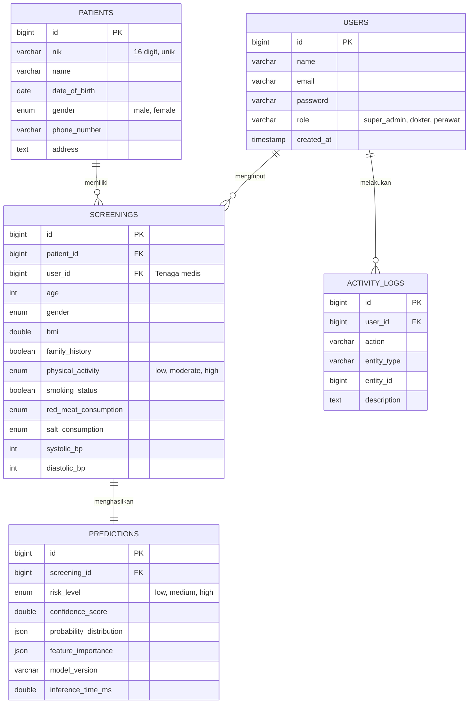

# Struktur Database (ERD) & Penjelasan Tabel

Seluruh struktur database di dalam file `database/hypertension_sd.sql` **sudah 100% sesuai** dengan jalannya aplikasi (Backend Laravel & ML Engine Python) saat ini. Struktur ini sudah dirancang dengan relasi yang tepat sehingga sangat aman untuk Anda masukkan ke dalam Bab Perancangan Sistem / Database di laporan skripsi Anda.

Berikut adalah diagram relasi entitas (ERD) beserta penjelasan yang bisa Anda salin ke laporan:

## 1. Entity Relationship Diagram (ERD)

Anda dapat menggunakan diagram di bawah ini sebagai acuan pembuatan UML / ERD di laporan Anda.

## 2. Penjelasan Relasi (Untuk Narasi Laporan)

Di dalam penulisan laporan skripsi, Anda dapat mendeskripsikan relasinya seperti ini:

1. **Relasi `users` (Tenaga Medis) ke `screenings` (Skrining) - (One-to-Many):**
   Satu tenaga medis (dokter/perawat) dapat melakukan input untuk banyak data skrining pasien. Namun, setiap satu catatan skrining hanya diinput oleh satu tenaga medis secara spesifik.
2. **Relasi `patients` (Pasien) ke `screenings` (Skrining) - (One-to-Many):**
   Satu pasien dapat melakukan proses skrining hipertensi berkali-kali di waktu yang berbeda (misalnya skrining bulan ini dan bulan depan). Oleh karena itu, satu ID pasien bisa tertaut pada banyak ID skrining.
3. **Relasi `screenings` (Skrining) ke `predictions` (Prediksi AI) - (One-to-One):**
   Setiap satu kali pengisian form skrining akan diproses oleh model XGBoost (Machine Learning Engine), dan **hanya akan** menghasilkan tepat satu record hasil prediksi (menyimpan skor probabilitas dan tingkat risiko).
4. **Tabel `activity_logs`:**
   Tabel ini berdiri sebagai pencatatan jejak audit (audit trail) untuk mencatat aktivitas apa saja yang dilakukan oleh *user* (seperti login atau input data) demi keamanan sistem.
