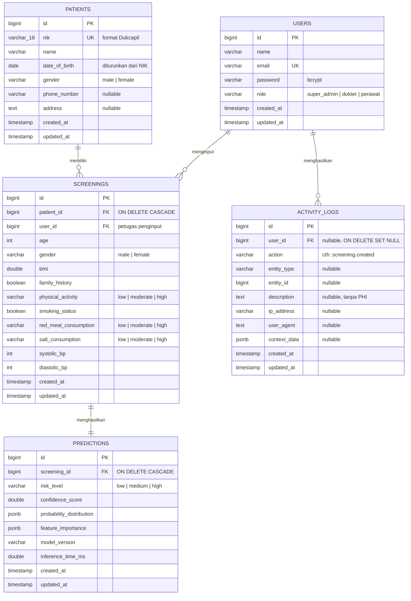

# Perancangan Basis Data — Sistem Deteksi Dini Risiko Hipertensi (HT-Detect)

> **Sumber kebenaran skema:** migration Laravel di `backend/database/migrations/`, dijalankan pada **PostgreSQL 15** (container `hyper_postgres`, database `db_hipertensi`).
> Padanan MySQL untuk phpMyAdmin/lampiran tersedia di `hypertension_db.sql` (root proyek).
> Terakhir disinkronkan dengan skema live: **16 Juli 2026**.

---

## 1. Gambaran Umum

Basis data menyimpan lima entitas inti ditambah satu tabel infrastruktur autentikasi:

| Tabel | Peran |
|---|---|
| `users` | Akun tenaga kesehatan (super_admin, dokter, perawat) |
| `patients` | Data induk pasien (identitas berbasis NIK) |
| `screenings` | Satu sesi skrining = 10 fitur klinis input model |
| `predictions` | Hasil inferensi ML Engine untuk satu skrining |
| `activity_logs` | Jejak audit aktivitas pengguna (tanpa PHI) |
| `personal_access_tokens` | Token Bearer Laravel Sanctum |

Prinsip desain:

1. **Pemisahan input dan output model** — data klinis yang diinput (screenings) dipisah dari hasil prediksi (predictions), sehingga satu skrining dapat diprediksi ulang saat model diganti tanpa kehilangan data asli.
2. **Identitas pasien = NIK** — unik 16 digit; tanggal lahir & jenis kelamin diturunkan dari digit ke-7 s/d 12 sesuai format Dukcapil.
3. **JSONB untuk output model** — distribusi probabilitas dan feature importance disimpan sebagai JSONB agar fleksibel terhadap perubahan skema model.
4. **Audit tanpa PHI** — activity_logs hanya menyimpan deskripsi tersanitasi, bukan data kesehatan pasien.

---

## 2. Entity Relationship Diagram (ERD)

---

## 3. Kamus Data

### 3.1 Tabel `users`

| Kolom | Tipe | Constraint | Keterangan |
|---|---|---|---|
| id | BIGINT | PK, auto increment | — |
| name | VARCHAR(255) | NOT NULL | Nama tenaga kesehatan |
| email | VARCHAR(255) | NOT NULL, UNIQUE | Kredensial login |
| email_verified_at | TIMESTAMP | NULL | Bawaan Laravel, tidak dipakai aktif |
| password | VARCHAR(255) | NOT NULL | Hash bcrypt |
| role | VARCHAR(255) | NOT NULL, DEFAULT `'perawat'` | `super_admin` / `dokter` / `perawat` |
| remember_token | VARCHAR(100) | NULL | Bawaan Laravel |
| created_at, updated_at | TIMESTAMP | NULL | Timestamps Eloquent |

### 3.2 Tabel `patients`

| Kolom | Tipe | Constraint | Keterangan |
|---|---|---|---|
| id | BIGINT | PK, auto increment | — |
| nik | VARCHAR(16) | NOT NULL, UNIQUE | 16 digit; digit 7–12 = DDMMYY lahir (perempuan: DD+40) |
| name | VARCHAR(255) | NOT NULL | Nama sesuai KTP |
| date_of_birth | DATE | NOT NULL | Diturunkan otomatis dari NIK di frontend |
| gender | VARCHAR/ENUM | NOT NULL, CHECK `male/female` | Diturunkan otomatis dari NIK |
| phone_number | VARCHAR(255) | NULL | Diinput sebagai field `phone` di API, dipetakan controller |
| address | TEXT | NULL | — |
| created_at, updated_at | TIMESTAMP | NULL | — |

### 3.3 Tabel `screenings` — 10 fitur klinis model

| Kolom | Tipe | Constraint | Keterangan (satuan/kategori) |
|---|---|---|---|
| id | BIGINT | PK | — |
| patient_id | BIGINT | FK → patients.id, ON DELETE CASCADE | — |
| user_id | BIGINT | FK → users.id | Petugas penginput |
| age | INT | NOT NULL, validasi 18–100 | Tahun |
| gender | VARCHAR/ENUM | CHECK `male/female` | — |
| bmi | DOUBLE | NOT NULL, validasi 10–60 | kg/m², dihitung dari BB & TB |
| family_history | BOOLEAN | NOT NULL | Riwayat keluarga hipertensi/diabetes |
| physical_activity | VARCHAR/ENUM | CHECK `low/moderate/high` | low ≤1×/mgg, moderate 2–4×/mgg, high ≥5×/mgg (PERKI) |
| smoking_status | BOOLEAN | NOT NULL | Perokok aktif |
| red_meat_consumption | VARCHAR/ENUM | CHECK `low/moderate/high` | low ≤1 porsi/mgg, moderate 2–4, high ≥5 (1 porsi ≈ 50–70 g) |
| salt_consumption | VARCHAR/ENUM | CHECK `low/moderate/high` | low <35 g/mgg, moderate 35–42, high >42 (PERKI/WHO <5 g/hari) |
| systolic_bp | INT | NOT NULL, validasi 70–250 | mmHg |
| diastolic_bp | INT | NOT NULL, validasi 40–150 | mmHg |
| created_at, updated_at | TIMESTAMP | NULL | — |

### 3.4 Tabel `predictions`

| Kolom | Tipe | Constraint | Keterangan |
|---|---|---|---|
| id | BIGINT | PK | — |
| screening_id | BIGINT | FK → screenings.id, ON DELETE CASCADE | Relasi 1:1 dengan skrining |
| risk_level | VARCHAR/ENUM | CHECK `low/medium/high` | Kelas prediksi model |
| confidence_score | DOUBLE | NOT NULL | Probabilitas kelas terpilih (0–1) |
| probability_distribution | JSONB | NOT NULL | `{"low": x, "medium": y, "high": z}` |
| feature_importance | JSONB | NOT NULL | Array 10 fitur `{feature, importance, label}` |
| model_version | VARCHAR(255) | NOT NULL | cth `1.0.0-sgo-mock` |
| inference_time_ms | DOUBLE | NOT NULL | Waktu inferensi ML Engine |
| created_at, updated_at | TIMESTAMP | NULL | — |

### 3.5 Tabel `activity_logs`

| Kolom | Tipe | Constraint | Keterangan |
|---|---|---|---|
| id | BIGINT | PK | — |
| user_id | BIGINT | FK → users.id, NULL, ON DELETE SET NULL | Pelaku aksi |
| action | VARCHAR(255) | NOT NULL | cth `user.login`, `screening.created`, `patient.updated` |
| entity_type | VARCHAR(255) | NULL | cth `App\Models\Screening` |
| entity_id | BIGINT | NULL | ID entitas terkait |
| description | TEXT | NULL | Deskripsi tersanitasi — **tanpa PHI** |
| ip_address | VARCHAR(255) | NULL | — |
| user_agent | TEXT | NULL | — |
| context_data | JSONB | NULL | Konteks tambahan tersanitasi |
| created_at, updated_at | TIMESTAMP | NULL | — |

### 3.6 Tabel `personal_access_tokens` (Laravel Sanctum)

| Kolom | Tipe | Keterangan |
|---|---|---|
| id | BIGINT PK | — |
| tokenable_type, tokenable_id | VARCHAR, BIGINT | Polimorfik → `users` |
| name | VARCHAR/TEXT | Nama token (`spa-token`) |
| token | VARCHAR(64) UNIQUE | Hash SHA-256 token |
| abilities | TEXT NULL | Scope token |
| last_used_at, expires_at | TIMESTAMP NULL | — |

---

## 4. Relasi & Aturan Integritas

| Relasi | Kardinalitas | Aturan hapus |
|---|---|---|
| patients → screenings | 1 : N | CASCADE (hapus pasien = hapus skriningnya) |
| users → screenings | 1 : N | RESTRICT (user tak bisa dihapus jika punya skrining) |
| screenings → predictions | 1 : 1 | CASCADE |
| users → activity_logs | 1 : N | SET NULL (log tetap ada meski user dihapus) |

**Alur data satu skrining:** `patients` di-*firstOrCreate* berdasarkan NIK → baris `screenings` dibuat (transaksi DB) → backend memanggil ML Engine → baris `predictions` disimpan → `activity_logs` dicatat → transaksi *commit*. Jika ML Engine gagal, seluruh transaksi *rollback* sehingga tidak ada skrining tanpa prediksi.

---

## 5. Catatan Implementasi

- **PostgreSQL (produksi/Docker):** enum diimplementasikan sebagai `VARCHAR + CHECK constraint` (perilaku default Laravel `enum()`), JSON memakai `JSONB`.
- **MySQL (padanan phpMyAdmin):** memakai `ENUM(...)` asli dan `JSON` — lihat `hypertension_db.sql`.
- Seeder akun: `admin@admin.com`, `dokter@admin.com`, `perawat@admin.com` (password: `password`).
- Migration: 6 file di `backend/database/migrations/` dengan prefix `2024_01_01_*` + `2019_12_14_*` (Sanctum).
