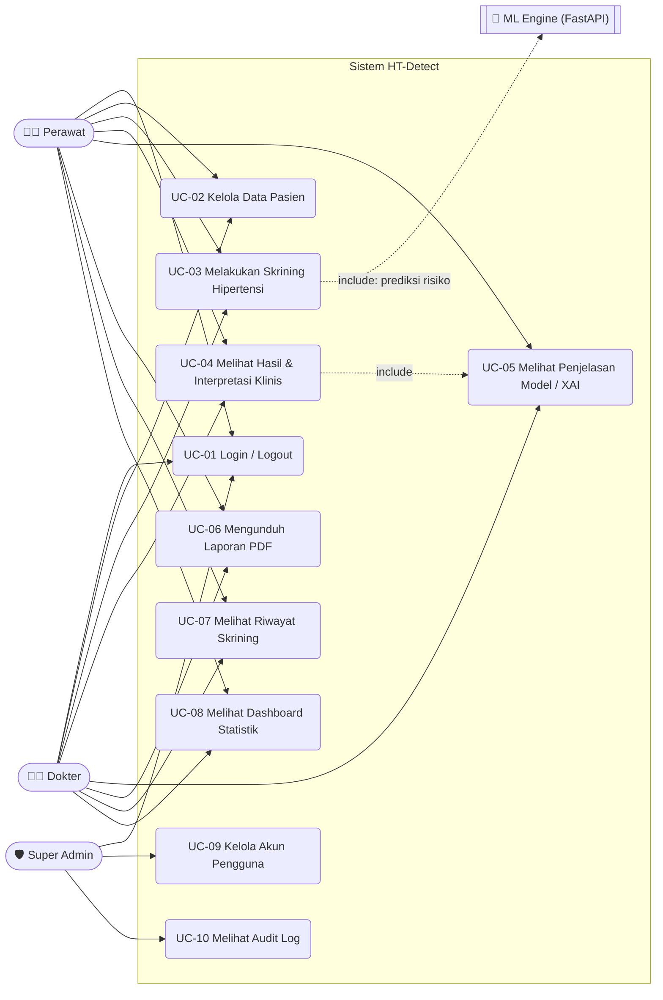
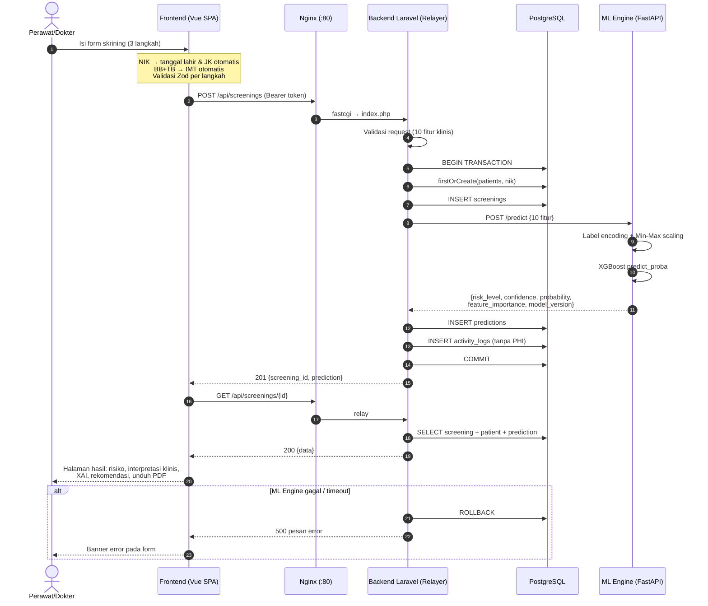
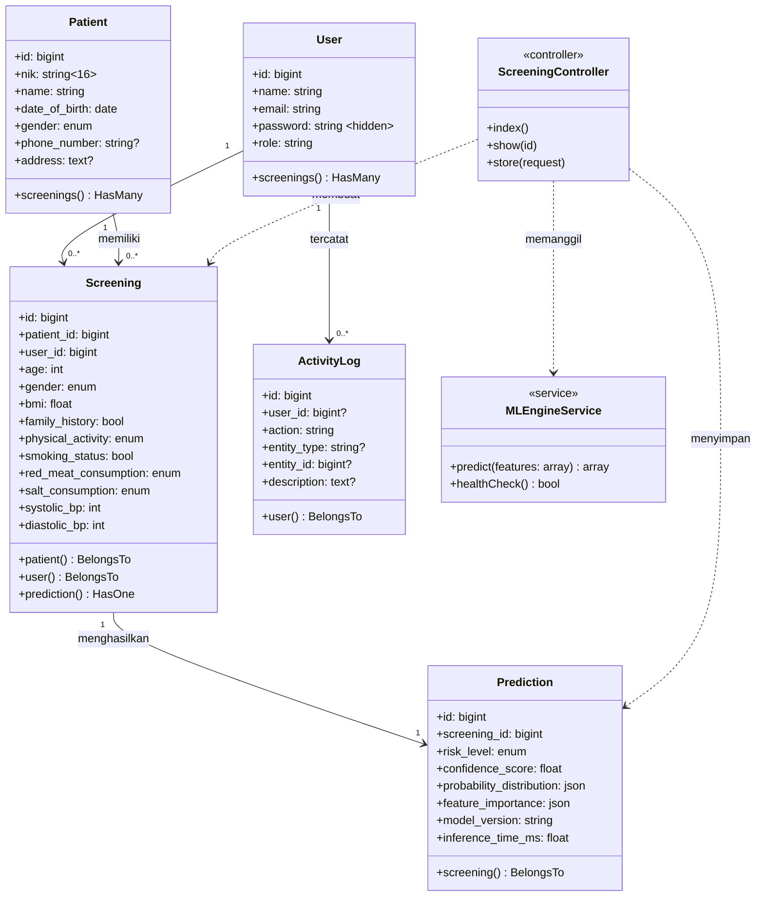
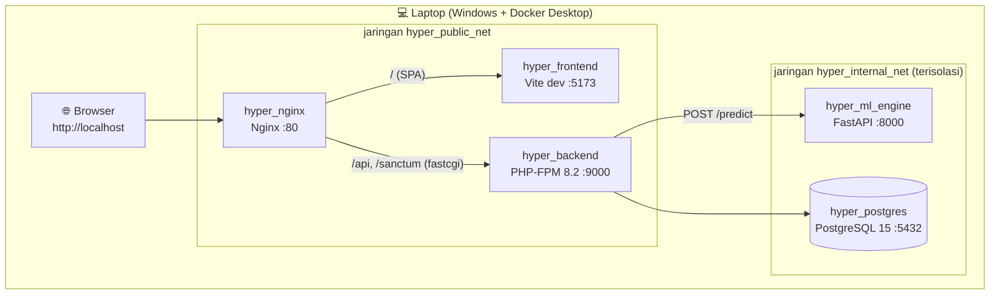

# Use Case & Diagram UML — Sistem Deteksi Dini Risiko Hipertensi (HT-Detect)

> Arsitektur: **Relayer Architecture** — Frontend (Vue 3 SPA) → Backend/Relayer (Laravel 11 REST API) → ML Engine (FastAPI + XGBoost-SGO), database PostgreSQL, reverse proxy Nginx, seluruhnya berjalan lokal via Docker Compose.

---

## 1. Aktor

| Aktor | Deskripsi | Hak akses |
|---|---|---|
| **Perawat** | Tenaga kesehatan penginput data | Login, kelola pasien, skrining, lihat hasil & riwayat, dashboard, unduh PDF |
| **Dokter** | Tenaga medis pemeriksa | Sama dengan perawat (akses setara pada modul klinis) |
| **Super Admin** | Pengelola sistem | Semua di atas + kelola akun pengguna + lihat audit log |
| **ML Engine** *(sistem)* | Layanan prediksi internal (FastAPI) | Dipanggil backend, tidak diakses pengguna langsung |

---

## 2. Diagram Use Case

---

## 3. Deskripsi Use Case

| Kode | Nama | Aktor | Alur utama singkat |
|---|---|---|---|
| UC-01 | Login/Logout | Semua | Input email+password → Sanctum menerbitkan Bearer token → sesi aktif; logout mencabut token |
| UC-02 | Kelola Data Pasien | Perawat, Dokter | CRUD pasien; NIK unik; tanggal lahir & JK otomatis dari NIK |
| UC-03 | Skrining Hipertensi | Perawat, Dokter | Form 3 langkah (demografi → gaya hidup → tensi) → kirim ke backend → prediksi ML → simpan |
| UC-04 | Lihat Hasil & Interpretasi | Perawat, Dokter | Klasifikasi TD (PERKI/ACC-AHA), IMT (WHO Asia-Pasifik), faktor risiko, rekomendasi, tindak lanjut |
| UC-05 | Penjelasan Model (XAI) | Perawat, Dokter | Feature importance, confidence, distribusi probabilitas skrining terbaru |
| UC-06 | Unduh Laporan PDF | Perawat, Dokter | Render halaman hasil menjadi PDF (html2pdf) |
| UC-07 | Riwayat Skrining | Perawat, Dokter | Daftar skrining terpaginasi + detail per skrining |
| UC-08 | Dashboard Statistik | Perawat, Dokter | Total skrining, distribusi risiko, tren, 5 skrining terbaru |
| UC-09 | Kelola Akun Pengguna | Super Admin | CRUD user dengan role; dilindungi middleware `role:super_admin` |
| UC-10 | Audit Log | Super Admin | Daftar aktivitas (login, skrining dibuat, pasien diubah, dll.) |

**Prasyarat umum:** semua use case selain login membutuhkan token Sanctum yang valid (middleware `auth:sanctum`).

---

## 4. Sequence Diagram — UC-03 Skrining (Relayer Architecture)

---

## 5. Class Diagram — Model Domain Backend

---

## 6. Diagram Deployment (Docker Compose)

Jaringan `hyper_internal_net` bersifat *internal* — database dan ML Engine tidak dapat diakses dari luar host, hanya melalui backend (relayer).
